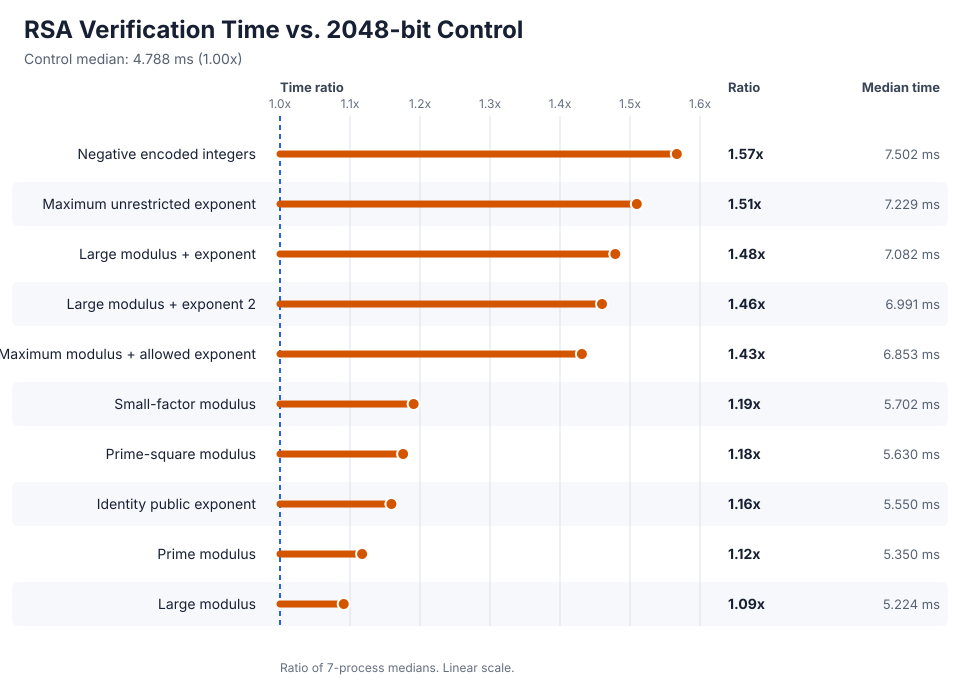
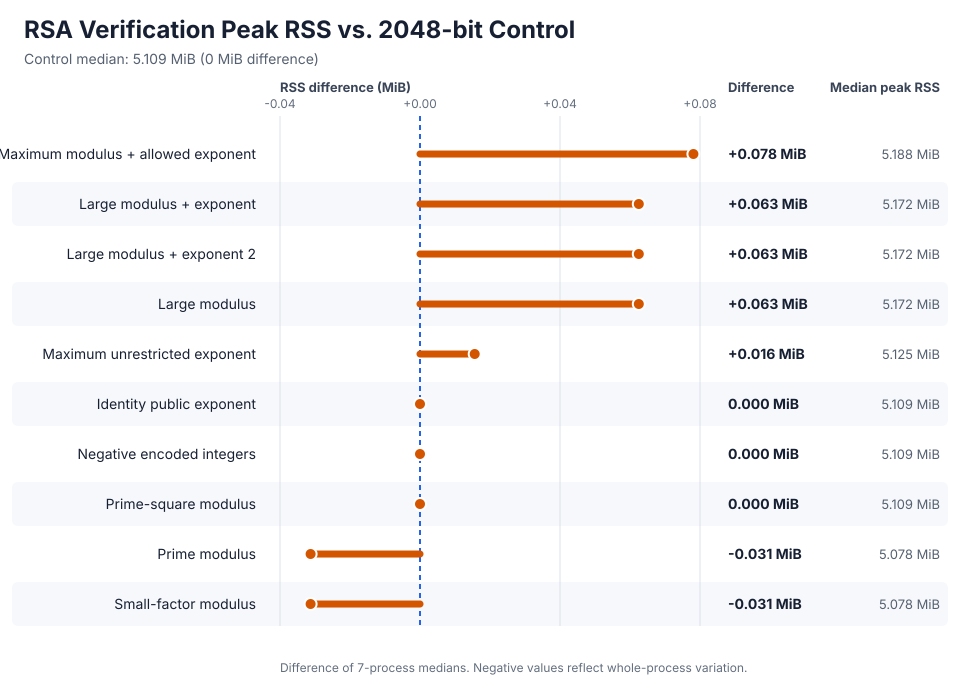
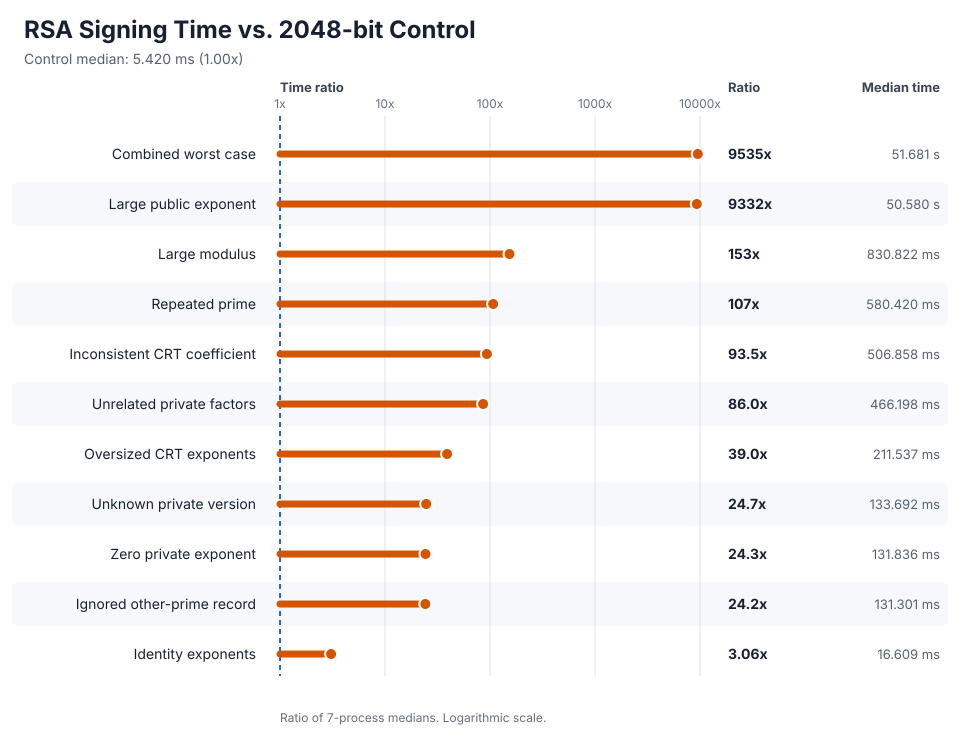
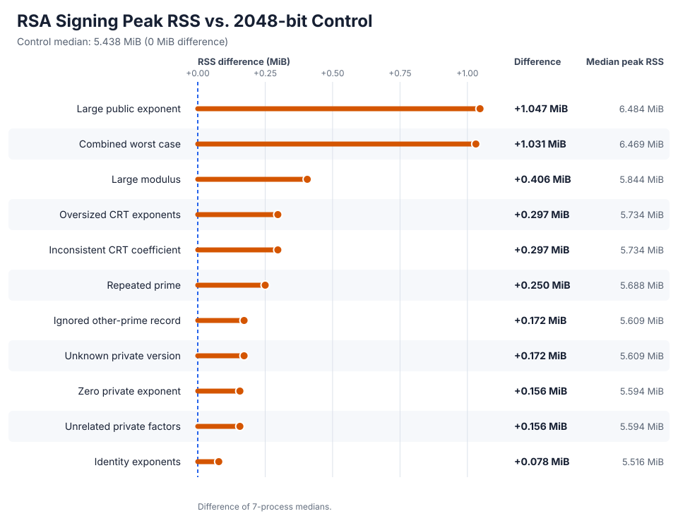

# Expensive RSA keys

This repository contains synthetic RSA keys designed to expose pathological behavior or consume excessive resources while being accepted by OpenSSL at a documented gate.

They are test fixtures, not operational credentials.

Run them only in a disposable environment with explicit wall, CPU, and memory limits.

Do not run them on a remote service using OpenSSL and accepting arbitrary user-supplied keys without additional validation.

`bad-public-keys/` targets verification and encryption.

`bad-secret-keys/` targets signing and contains a private key, derived public key, the six-byte `kaboom` input, and matching binary and URL-safe base64 signatures for each case.

## Operation cost

The verification graph compares every SHA-256 PKCS#1 v1.5 fixture with an expected successful verification against a freshly generated 2048-bit RSA control using `e=65537`.
The signing graph compares every secret fixture with the same control.
The time graphs divide each reported median by the matching control median and rank fixtures by the resulting ratio.
The memory graphs subtract the control median and show the difference in whole-process peak RSS.
Every label retains the absolute median so the comparison does not hide the measured scale.

Time and peak memory are split because the signing-time ratios span nearly four orders of magnitude while whole-process RSS changes by less than 20 percent.
Each result is the median of seven fresh OpenSSL processes.
Wall time includes process startup and key loading, while peak resident set size covers the complete OpenSSL process.
Small RSS differences close to zero include whole-process measurement variation and should not be interpreted as exact algorithm allocations.
The CSV contains reported medians only, so the graphs do not imply uncertainty estimates or statistically significant differences.

Measurements used OpenSSL 3.6.3 on arm64 macOS with SHA-256 and PKCS#1 v1.5 padding.

### Verification cost

Exact verification medians

| Fixture                            | Time vs. control |   Peak RSS vs. control |
| ---------------------------------- | ---------------: | ---------------------: |
| Negative encoded integers          | 1.57x (7.502 ms) |  0.000 MiB (5.109 MiB) |
| Maximum unrestricted exponent      | 1.51x (7.229 ms) | +0.016 MiB (5.125 MiB) |
| Large modulus + exponent           | 1.48x (7.082 ms) | +0.063 MiB (5.172 MiB) |
| Large modulus + exponent 2         | 1.46x (6.991 ms) | +0.063 MiB (5.172 MiB) |
| Maximum modulus + allowed exponent | 1.43x (6.853 ms) | +0.078 MiB (5.188 MiB) |
| Small-factor modulus               | 1.19x (5.702 ms) | -0.031 MiB (5.078 MiB) |
| Prime-square modulus               | 1.18x (5.630 ms) |  0.000 MiB (5.109 MiB) |
| Identity public exponent           | 1.16x (5.550 ms) |  0.000 MiB (5.109 MiB) |
| Prime modulus                      | 1.12x (5.350 ms) | -0.031 MiB (5.078 MiB) |
| Large modulus                      | 1.09x (5.224 ms) | +0.063 MiB (5.172 MiB) |

### Signing cost

The signing-time graph uses a logarithmic ratio axis.

Exact signing medians

| Fixture                      |   Time vs. control |   Peak RSS vs. control |
| ---------------------------- | -----------------: | ---------------------: |
| Combined worst case          |  9,535x (51.681 s) | +1.031 MiB (6.469 MiB) |
| Large public exponent        |  9,332x (50.580 s) | +1.047 MiB (6.484 MiB) |
| Large modulus                |  153x (830.822 ms) | +0.406 MiB (5.844 MiB) |
| Repeated prime               |  107x (580.420 ms) | +0.250 MiB (5.688 MiB) |
| Inconsistent CRT coefficient | 93.5x (506.858 ms) | +0.297 MiB (5.734 MiB) |
| Unrelated private factors    | 86.0x (466.198 ms) | +0.156 MiB (5.594 MiB) |
| Oversized CRT exponents      | 39.0x (211.537 ms) | +0.297 MiB (5.734 MiB) |
| Unknown private version      | 24.7x (133.692 ms) | +0.172 MiB (5.609 MiB) |
| Zero private exponent        | 24.3x (131.836 ms) | +0.156 MiB (5.594 MiB) |
| Ignored other-prime record   | 24.2x (131.301 ms) | +0.172 MiB (5.609 MiB) |
| Identity exponents           |  3.06x (16.609 ms) | +0.078 MiB (5.516 MiB) |

The [reported medians](docs/benchmarks/rsa-operation-profile.csv) are checked in as CSV.

## Public-key cases

OpenSSL 3.6.3 applies different rules while loading, checking, and using a public key.

The default provider applies no RSA width policy while loading ASN.1 integers, while `pkey -pubcheck` limits the modulus to 16384 bits but does not cap the exponent or require `e < n`.

`pkey -pubcheck` also rejects exponents below three, small modulus factors, prime moduli, and prime-power moduli.
The low-level public operation path does not repeat those arithmetic checks.

Public exponentiation requires `n <= 16384` and `e < n`; when `n > 3072`, it also requires `e <= 64` bits.
This branch prevents one key from combining the 16384-bit modulus limit with the dense 3072-bit exponent used by `maximum-unrestricted-exponent`.

Those boundaries are defined in [`rsa.h`](https://github.com/openssl/openssl/blob/openssl-3.6.3/include/openssl/rsa.h#L38-L57) and enforced in [`rsa_ossl.c`](https://github.com/openssl/openssl/blob/openssl-3.6.3/crypto/rsa/rsa_ossl.c#L106-L130).

`Load` below means successful default-provider decoding through `openssl pkey -pubin -noout`.
Every verification case contains the `kaboom` input and matching binary and URL-safe base64 signatures.
Cases with a reusable source private key also contain `rsa_key.pem`.

| Case                                    | Construction                                                          | OpenSSL acceptance                | Intended pressure                                     |
| --------------------------------------- | --------------------------------------------------------------------- | --------------------------------- | ----------------------------------------------------- |
| `all-zeros`                             | Zero-valued `n` and `e` with 1001-byte and 101-byte INTEGER encodings | Load                              | Noncanonical parser input                             |
| `huge-modulus-and-exponent`             | 80000000-bit all-ones `n` and 8000-bit all-ones `e`                   | Load                              | Existing 10 MB DER parser case                        |
| `huge-modulus`                          | 268435456-bit all-ones `n` and `e=65537`                              | Load                              | Isolated 32 MiB modulus INTEGER                       |
| `huge-public-exponent`                  | Valid 16384-bit `n` and a 268435456-bit all-ones `e`                  | Load, `pubcheck`                  | Isolated 32 MiB exponent INTEGER                      |
| `zero-public-exponent`                  | Valid 16384-bit `n` and `e=0`                                         | Load, encrypt                     | Every OAEP ciphertext is integer one                  |
| `identity-public-exponent`              | Valid 16384-bit `n` and `e=1`                                         | Load, verify, encrypt             | The encoded message itself is a valid signature       |
| `negative-encoded-modulus-and-exponent` | Valid `n` and `e` encoded as negative ASN.1 INTEGERs                  | Load, `pubcheck`, verify, encrypt | Signed DER values are imported as unsigned magnitudes |
| `prime-modulus`                         | Known 8192-bit prime `n` and `e=65537`                                | Load, verify, encrypt             | Prime modulus accepted by public operations           |
| `prime-square-modulus`                  | `n=p^2` for a known 8192-bit prime and `e=65537`                      | Load, verify, encrypt             | Prime-power modulus accepted by public operations     |
| `small-factor-modulus`                  | `n=3q` for a known 8192-bit prime and `e=65537`                       | Load, verify, encrypt             | Factor-three modulus accepted by public operations    |
| `invalid-pss-trailer`                   | RSA-PSS restriction with salt length zero and `trailerField=2`        | Load, `pubcheck`, PSS verify      | Provider ignores an invalid PSS trailer restriction   |
| `large-modulus-large-exponent`          | 16384-bit `n` and dense 64-bit `e=0xffffffffffffffc5`                 | Load, `pubcheck`, verify, encrypt | Existing accepted arithmetic case                     |
| `large-modulus-large-exponent2`         | Independent key with the same widths and exponent                     | Load, `pubcheck`, verify, encrypt | Existing accepted arithmetic case                     |
| `large-modulus`                         | 16384-bit `n` and `e=65537`                                           | Load, `pubcheck`, verify, encrypt | Maximum accepted modulus in isolation                 |
| `maximum-modulus-and-exponent`          | 16384-bit `n` and `e=2^64-1`                                          | Load, `pubcheck`, verify, encrypt | Exact joint operation limits                          |
| `maximum-unrestricted-exponent`         | 3072-bit `n` and dense 3072-bit `e` with weight 3059                  | Load, `pubcheck`, verify, encrypt | Largest exponent width below the 64-bit policy branch |

The arithmetic width boundaries are finite and the generated cases reach them exactly.
Parser integer sizes have no finite RSA policy maximum, so the two new defaults use 256 Mbit fields and `--parser-bits` supports larger controlled experiments.

The invalid RSA-PSS key uses SHA-1, PSS padding, and a zero-length salt so its signature is deterministic.
OpenSSL 3.6.3 copies the unverified trailer restriction in [`rsa_backend.c`](https://github.com/openssl/openssl/blob/openssl-3.6.3/crypto/rsa/rsa_backend.c#L584-L618), but the provider signature path in [`rsa_sig.c.in`](https://github.com/openssl/openssl/blob/openssl-3.6.3/providers/implementations/signature/rsa_sig.c.in#L542-L595) never consults it.
The legacy validation path explicitly rejects trailer fields other than one in [`rsa_ameth.c`](https://github.com/openssl/openssl/blob/openssl-3.6.3/crypto/rsa/rsa_ameth.c#L592-L605).

## Secret-key cases

All timings below use seven fresh OpenSSL processes with SHA-256 and PKCS#1 v1.5 padding. They were measured with OpenSSL 3.6.3 on arm64 macOS.

The original 16384-bit key signs in about 0.122 seconds on the same host.

| Case                                | Construction                                                             | Important widths             | Median sign time |
| ----------------------------------- | ------------------------------------------------------------------------ | ---------------------------- | ---------------: |
| `large-modulus`                     | Squares both known prime factors, then recomputes the private parameters | `n=32768`, `e=64`            |          0.831 s |
| `oversized-congruent-crt-exponents` | Lifts `dP` and `dQ` by multiples of `p-1` and `q-1`                      | `n=16384`, `dP=dQ=16384`     |          0.212 s |
| `inconsistent-crt-coefficient`      | Replaces `qInv` with `qInv+1`, forcing OpenSSL's full-`d` fallback       | `n=16384`, `d=16383`         |          0.507 s |
| `large-public-exponent`             | Replaces `e` with a dense congruent representative modulo `lambda(n)`    | `n=16384`, `e=1048576`       |         50.580 s |
| `combined-worst-case`               | Combines dense maximum-width private exponents, large `e`, and `qInv+1`  | `e=1048576`, `d=dP=dQ=16384` |         51.681 s |

The semantic secret-key cases are operational even though their redundant fields or encodings violate RSA expectations.
Private `pkey -check` is reported as a separate validation gate, not as the signing acceptance test.

| Case                                  | Construction                                                 | `pkey -check` | Median sign time |
| ------------------------------------- | ------------------------------------------------------------ | ------------- | ---------------: |
| `identity-exponents`                  | Sets `e=d=dP=dQ=1` while retaining the base factors          | Rejects       |          0.017 s |
| `zero-private-exponent`               | Sets `d=0` while retaining the valid CRT tuple               | Rejects       |          0.132 s |
| `unrelated-private-factors`           | Stores `p=3` and `q=5` beside the base `n`, `e`, and `d`     | Rejects       |          0.466 s |
| `two-prime-version-with-other-primes` | Appends a zero `OtherPrimeInfo` record to a version-zero key | Accepts       |          0.131 s |
| `unknown-private-version`             | Changes the two-prime PKCS#1 version from zero to two        | Accepts       |          0.134 s |
| `repeated-prime`                      | Uses `p=q`, `n=p^2`, a valid full `d`, and `qInv=0`          | Rejects       |          0.580 s |

The 32768-bit modulus and 1048576-bit public exponent exceed OpenSSL's public-operation policy limits, although the default provider loads their private keys and signs with them.

The checker validates those signatures independently.

The other cases also verify through `openssl dgst`.

OpenSSL selects CRT whenever all CRT fields are present.

It uses the stored `dP` and `dQ`, checks the result by exponentiating with `e`, and recomputes with full `d` when inconsistent CRT data fails that check.

The PKCS#1 decoder accepts optional `OtherPrimeInfos` for every version, but OpenSSL initializes and validates those records only when the version is exactly one.
Undefined private-key versions also follow the ordinary two-prime path.
