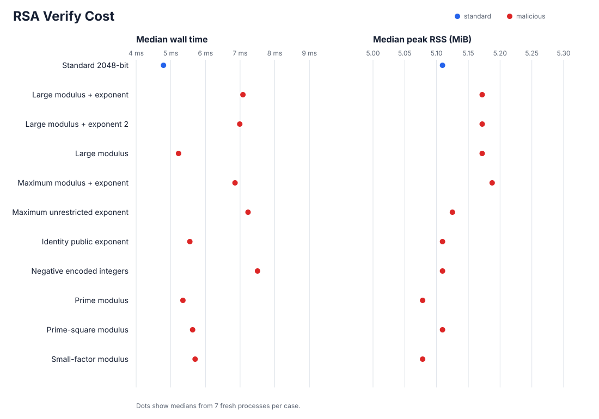
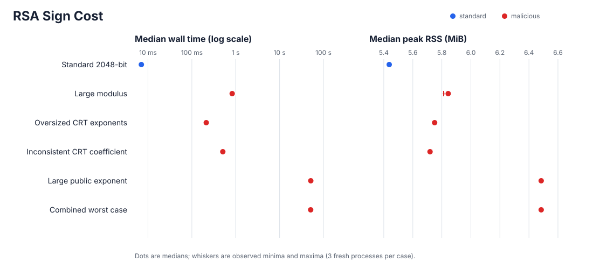

# Expensive RSA keys

This repository contains synthetic RSA keys designed to consume excessive resources during public or private operations, while being accepted by default by OpenSSL.

They are test fixtures, not operational credentials.

Run them only in a disposable environment with explicit wall, CPU, and memory limits.

Do not run them on a remote service using OpenSSL and accepting arbitrary user-supplied keys without additional validation.

`bad-public-keys/` targets verification and encryption.

`bad-secret-keys/` targets signing and contains a private key, derived public key, the six-byte `kaboom` input, and matching binary and URL-safe base64 signatures for each case.

## Operation cost

The graphs compare every operation-capable malicious fixture with a freshly generated 2048-bit RSA control using `e=65537`.
Each point is the median of three fresh OpenSSL processes, and the whiskers show the observed range.
Wall time includes process startup and key loading, while peak resident set size covers the complete OpenSSL process.

Measurements used OpenSSL 3.6.3 on arm64 macOS with SHA-256 and PKCS#1 v1.5 padding.

Signing uses a logarithmic time axis because the cases span nearly four orders of magnitude.

## Public-key cases

OpenSSL 3.6.3 applies different rules while loading, checking, and using a public key.

The default provider applies no RSA width policy while loading ASN.1 integers, while `pkey -pubcheck` limits the modulus to 16384 bits but does not cap the exponent or require `e < n`.

Public exponentiation requires `n <= 16384` and `e < n`; when `n > 3072`, it also requires `e <= 64` bits.

Those boundaries are defined in [`rsa.h`](https://github.com/openssl/openssl/blob/openssl-3.6.3/include/openssl/rsa.h#L38-L57) and enforced in [`rsa_ossl.c`](https://github.com/openssl/openssl/blob/openssl-3.6.3/crypto/rsa/rsa_ossl.c#L106-L130).

`Load` below means successful default-provider decoding through `openssl pkey -pubin -noout`.
Operation-capable directories also contain their source private key, the `kaboom` input, and matching signatures so verification can be reproduced.

| Case                            | Construction                                                          | OpenSSL acceptance                | Intended pressure                                     |
| ------------------------------- | --------------------------------------------------------------------- | --------------------------------- | ----------------------------------------------------- |
| `all-zeros`                     | Zero-valued `n` and `e` with 1001-byte and 101-byte INTEGER encodings | Load                              | Noncanonical parser input                             |
| `huge-modulus-and-exponent`     | 80000000-bit all-ones `n` and 8000-bit all-ones `e`                   | Load                              | Existing 10 MB DER parser case                        |
| `huge-modulus`                  | 268435456-bit all-ones `n` and `e=65537`                              | Load                              | Isolated 32 MiB modulus INTEGER                       |
| `huge-public-exponent`          | Valid 16384-bit `n` and a 268435456-bit all-ones `e`                  | Load, `pubcheck`                  | Isolated 32 MiB exponent INTEGER                      |
| `large-modulus-large-exponent`  | 16384-bit `n` and dense 64-bit `e=0xffffffffffffffc5`                 | Load, `pubcheck`, verify, encrypt | Existing accepted arithmetic case                     |
| `large-modulus-large-exponent2` | Independent key with the same widths and exponent                     | Load, `pubcheck`, verify, encrypt | Existing accepted arithmetic case                     |
| `large-modulus`                 | 16384-bit `n` and `e=65537`                                           | Load, `pubcheck`, verify, encrypt | Maximum accepted modulus in isolation                 |
| `maximum-modulus-and-exponent`  | 16384-bit `n` and `e=2^64-1`                                          | Load, `pubcheck`, verify, encrypt | Exact joint operation limits                          |
| `maximum-unrestricted-exponent` | 3072-bit `n` and dense 3072-bit `e` with weight 3059                  | Load, `pubcheck`, verify, encrypt | Largest exponent width below the 64-bit policy branch |

The arithmetic width boundaries are finite and the generated cases reach them exactly.
Parser integer sizes have no finite RSA policy maximum, so the two new defaults use 256 Mbit fields and `--parser-bits` supports larger controlled experiments.

## Secret-key cases

All timings below use three fresh OpenSSL processes with SHA-256 and PKCS#1 v1.5 padding. They were measured with OpenSSL 3.6.3 on arm64 macOS.

The original 16384-bit key signs in about 0.122 seconds on the same host.

| Case                                | Construction                                                             | Important widths             | Median sign time |
| ----------------------------------- | ------------------------------------------------------------------------ | ---------------------------- | ---------------: |
| `large-modulus`                     | Squares both known prime factors, then recomputes the private parameters | `n=32768`, `e=64`            |          0.839 s |
| `oversized-congruent-crt-exponents` | Lifts `dP` and `dQ` by multiples of `p-1` and `q-1`                      | `n=16384`, `dP=dQ=16384`     |          0.215 s |
| `inconsistent-crt-coefficient`      | Replaces `qInv` with `qInv+1`, forcing OpenSSL's full-`d` fallback       | `n=16384`, `d=16383`         |          0.513 s |
| `large-public-exponent`             | Replaces `e` with a dense congruent representative modulo `lambda(n)`    | `n=16384`, `e=1048576`       |         50.211 s |
| `combined-worst-case`               | Combines dense maximum-width private exponents, large `e`, and `qInv+1`  | `e=1048576`, `d=dP=dQ=16384` |         51.691 s |

The 32768-bit modulus and 1048576-bit public exponent exceed OpenSSL's public-operation policy limits, although the default provider loads their private keys and signs with them.

The checker validates those signatures independently.

The other cases also verify through `openssl dgst`.

OpenSSL selects CRT whenever all CRT fields are present.

It uses the stored `dP` and `dQ`, checks the result by exponentiating with `e`, and recomputes with full `d` when inconsistent CRT data fails that check.
